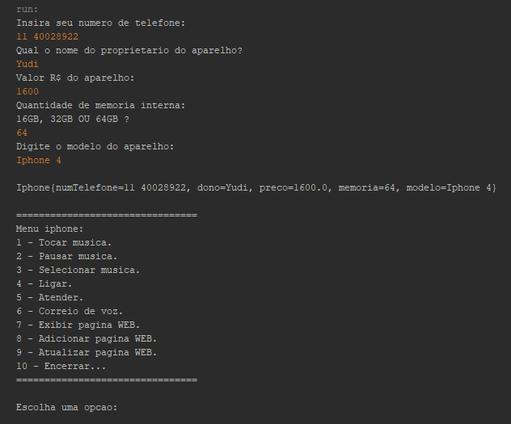
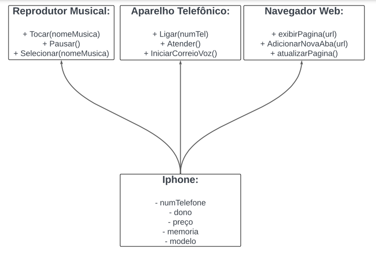

<h1 align="center">iPhone layout:</h1>

## 📖 About the project
In this project, developed using the Java language, I implemented basic inputs with validations. These inputs result in an output, which is a fully constructed iPhone object with its information. <br>
However, towards the end, we have a menu built with "switch cases" and loops. This menu provides action options to the user. Nevertheless, this basic challenge is part of a DIO Bootcamp: Santander Bootcamp | Fullstack Developer.




## 🦾 Technologies used
<div style="display: flex;">
  


</div>

## 🤔 What i learned
- improved my skills in polymorphism.
- I enhanced my skills in inheritance.
- I honed my skills in contracts between classes.
- I enhanced my skills in building projects layouts.
- Additionally, I refined my overall object-oriented programming (OOP) skills.

## 👽 How to clone this project

````bash
    # Select where you want to clone
    $ cd ~/Documents/WHERE_YOU_WANT
````

````bash
    # Clone the project
    $ git clone https://github.com/DevGustavus/REPOSITORY_NAME.git
````

````bash
    # Check if cloning worked fine
    $ cd ~/Documents/DIRECTORY_LOCATION
    $ ls
````
